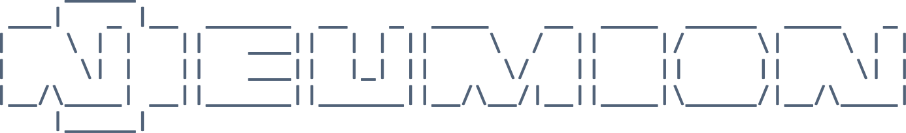

<div align="center">
    
</div>

---

<div align="center" display="flex">


</div>

--- 

Ever wondered what your favorite songs have in common? Neumion dives beneath the surface of your music to analyze the theory behind it, from tempo and key to chord progressions and other musical characteristics. Whether you're analyzing a single song, a playlist, or an entire album, Neumion reveals the patterns that define your taste and helps you discover music you'll love.

## Features

- Song Analysis


## Usage

```
git clone https://github.com/edmuri/Neumion.git
cd Neumion
```

Then, make sure you have FFmpeg installed for file conversion (necessary for music downloading)
```
sudo apt update && sudo apt install ffmpeg -y
```

Start the python environment and install requirements

```
cd env
python3 -m venv neumion
source neumion/bin/activate
pip install --upgrade pip setuptools wheel
pip install -r requirements.txt
```

```
python3 neumion.py -[COMMANDS]
```


## Copyright Notice
This repository does not include any music files due to copyright restrictions. If you wish to use copyrighted music with this project, you must obtain it legally (e.g., by purchasing it or otherwise acquiring a licensed copy). Any use of copyrighted material is your responsibility and should comply with applicable copyright laws and fair use provisions where they apply.